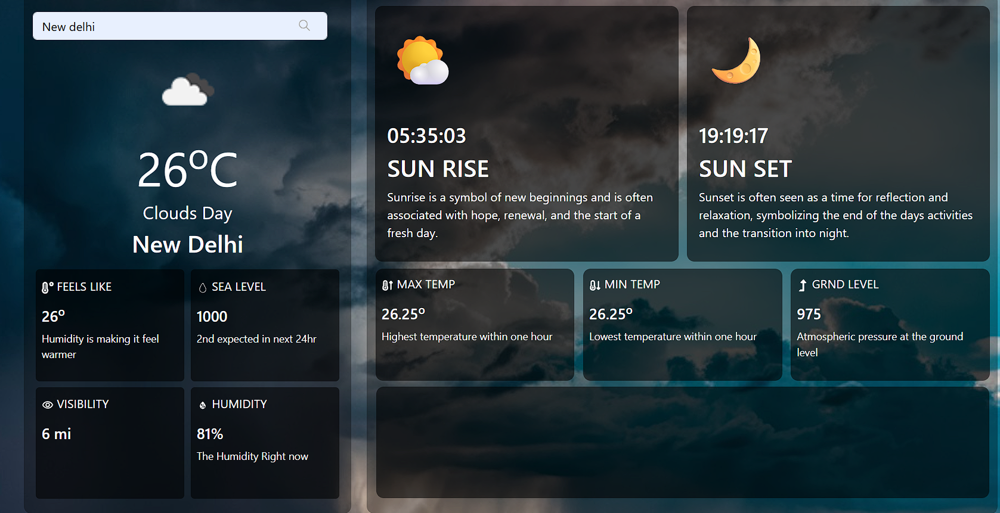

# 🌦️ WEATHER DASHBOARD

**COMPANY:** CODTECH IT SOLUTIONS  
**NAME:** Mo Aslam Khan  
**INTERN ID:** CT08DN1583  
**DOMAIN:** React.js Web Development  
**DURATION:** 8 WEEKS  
**MENTOR:** NEELA SANTOSH

---

## 📄 TASK DESCRIPTION

The Weather Dashboard project is one of the major tasks assigned during my internship at **CODTECH IT Solutions**. The objective of this project is to build a responsive, real-time weather dashboard using **React.js**, which fetches and displays current weather information for any city entered by the user. This task helped me understand how to work with APIs, handle data dynamically, manage user inputs, and build a clean, responsive interface using React.

The application interacts with the **OpenWeatherMap API**, which provides live weather data. Once the user enters a city name, the app sends a request to the API and displays data such as **temperature (in Celsius)**, **humidity**, **wind speed**, and **weather condition** (like clear sky, cloudy, rain, etc.). If a city name is incorrect or there is a network issue, the app gracefully handles it by showing a user-friendly error message. This ensures a smooth user experience.

One of the main goals during development was to keep the UI **clean, readable, and responsive** across all devices. I used CSS for styling and made sure the layout adjusts properly on both desktop and mobile screens. The app also includes a **loader** to indicate that data is being fetched in real time, giving feedback to the user during the process.

The core logic of the app is built in **React.js** using functional components and React Hooks like `useState` and `useEffect`. Data is fetched using the **fetch API** in JavaScript. The user interface is structured to show the city’s weather in a nicely formatted card, with different text and color indicators based on weather conditions. I also maintained a clean code structure and reused components where possible.

Another important focus of this project was **security and best practices**. Since the app uses an API key, I ensured the API key was **not pushed to GitHub**. Instead, I used a placeholder in the URL such as:

https://api.openweathermap.org/data/2.5/weather?q=CityName&units=metric&appid=EnterYourAPIKeyHere

This prevents unauthorized access or key leakage. Anyone who wants to clone or use this project needs to generate their own API key from OpenWeatherMap and replace the placeholder with their key. Optionally, developers can store the key in a `.env` file and access it using `process.env.REACT_APP_API_KEY` for added security in production.

---

## 🔧 Technologies Used:

- **React.js** – For building a dynamic, component-based UI  
- **JavaScript (ES6+)** – For data fetching and state handling  
- **HTML5 & CSS3** – For layout, design, and responsiveness  
- **OpenWeatherMap API** – To access real-time weather data  
- **Git & GitHub** – For version control and code collaboration

---

## ✅ Key Features:

- 🔍 Real-time weather search by city name  
- 🌡️ Displays current temperature, weather condition, humidity, wind speed  
- ❌ Proper error message for invalid input or network failure  
- ⏳ Loader/message shown while data is being fetched  
- 📱 Mobile-friendly and responsive design  
- 🔐 API key kept secure using placeholder (not exposed publicly)  
- 🧩 Clean and minimal user interface using soft colors and cards  

This project enhanced my understanding of **API handling, React lifecycle, UI design**, and **secure deployment practices**. I also practiced using **Git** for source control and hosting the code on **GitHub**.

---

## 🔒 API Key Handling

To keep the API key private, I replaced my personal key with a placeholder in the code. This ensures no sensitive data is exposed. Anyone cloning the project should:

1. Get a free API key from [OpenWeatherMap](https://openweathermap.org/api)  
2. Replace `EnterYourAPIKeyHere` in the API URL  
3. (Optional) Create a `.env` file in the root directory and add:  

---

## 📸 Output

---

✅ **This Weather Dashboard was successfully completed as part of my internship under CODTECH IT SOLUTIONS and demonstrates real-time API usage, responsive design, and clean code practices.**
